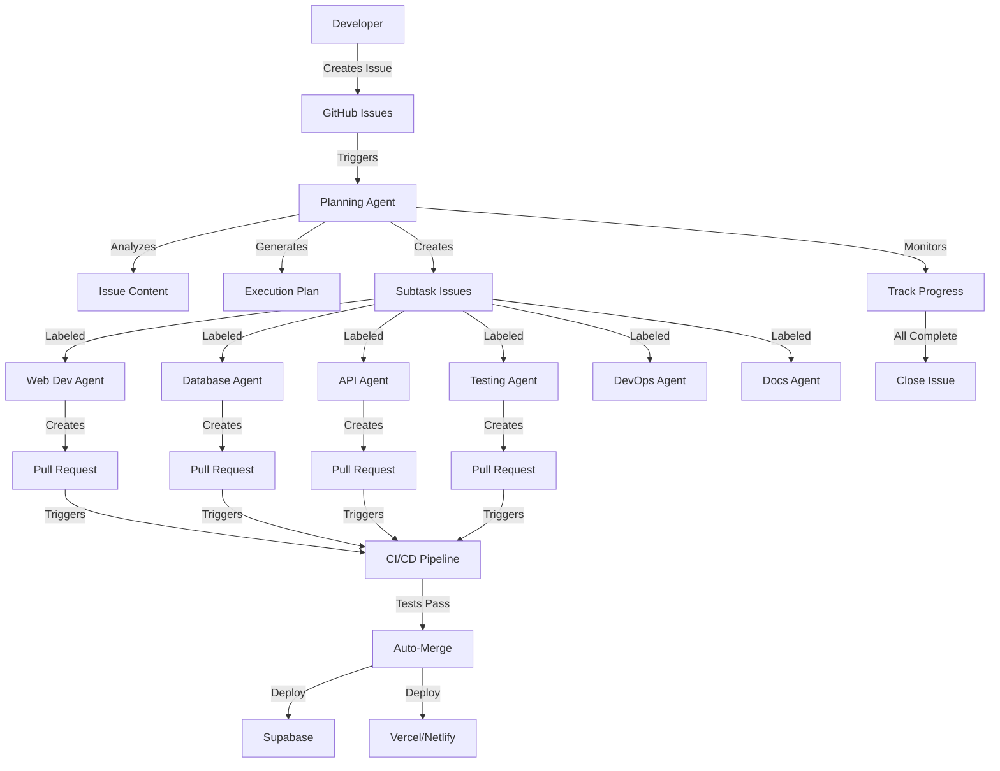
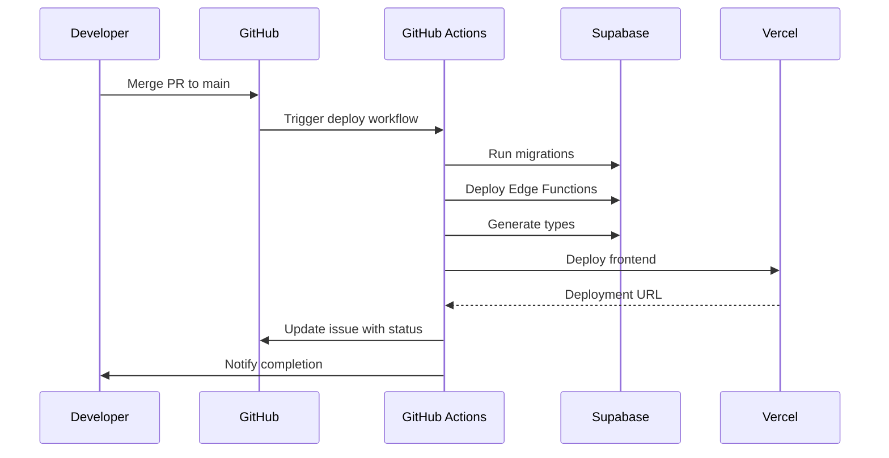

# Architecture Documentation - AI Agent Development Framework

## 🏗️ System Overview

This framework implements a **hierarchical multi-agent system** designed to maximize developer productivity through intelligent task automation. The architecture follows the **Planning-Execution-Review** pattern, with agents coordinating through GitHub's native infrastructure.

---

## 📊 Architecture Diagram



---

## 🎯 Core Components

### 1. Planning Agent (Tier 1)

**Purpose**: Top-level orchestrator for task decomposition and coordination

**Responsibilities**:
- Analyze incoming issues for complexity and requirements
- Decompose complex tasks using Chain-of-Thought reasoning
- Generate execution plans with dependency graphs
- Create labeled sub-issues for specialized agents
- Monitor progress and synthesize results
- Coordinate integration between agents

**Implementation**:
- **File**: `.github/workflows/planning-agent.yml`
- **Trigger**: Issue created/labeled with `agent:planning`
- **Runtime**: GitHub Actions (Ubuntu Latest)
- **Model**: Uses GitHub Models API for analysis

**Workflow**:
1. Issue created → Planning Agent triggered
2. Analyze requirements and identify complexity
3. Determine required agent types (database, web-dev, etc.)
4. Generate task decomposition with dependencies
5. Create subtask issues with appropriate labels
6. Update `project_plan.md` with execution DAG
7. Comment on parent issue with plan
8. Monitor subtask completion

---

### 2. Specialized Agents (Tier 2)

**Purpose**: Domain-specific executors handling focused tasks

#### Available Agents:

| Agent | Label | Expertise | Typical Tasks |
|-------|-------|-----------|---------------|
| **Web Dev** | `agent:web-dev` | React, Next.js, Tailwind | UI components, pages, styling |
| **Database** | `agent:database` | PostgreSQL, Supabase | Schema, migrations, RLS policies |
| **API** | `agent:api` | REST, GraphQL, Edge Functions | Endpoints, business logic |
| **Testing** | `agent:testing` | Jest, Playwright | Unit, integration, E2E tests |
| **DevOps** | `agent:devops` | CI/CD, Deployment | Pipelines, infrastructure |
| **Docs** | `agent:docs` | Markdown, Technical Writing | READMEs, API docs |

**Implementation**:
- **File**: `.github/workflows/specialized-agents.yml`
- **Trigger**: Issue labeled with specific `agent:*` label
- **Runtime**: GitHub Actions + GitHub Copilot Coding Agent
- **Execution Environment**: Isolated Codespace per agent

**Workflow**:
1. Issue labeled → Specialized Agent workflow triggered
2. Add progress comment to issue
3. Prepare environment (via `copilot-setup-steps.yml`)
4. Manual step: Assign to Copilot Coding Agent
5. Copilot works autonomously in secure environment
6. Creates PR when complete
7. Links PR to issue
8. Triggers validation workflows

---

### 3. Agent Environment (Copilot Setup)

**Purpose**: Provide consistent, isolated execution environment for agents

**Implementation**:
- **File**: `.github/workflows/copilot-setup-steps.yml`
- **Mandatory Name**: Job must be named `copilot-setup-steps`
- **Runtime**: GitHub Actions (Ubuntu only)
- **Permissions**: Minimal (contents: read)

**Capabilities**:
- Install Node.js 20, Python 3.11
- Install project dependencies (npm, pip)
- Install Supabase CLI
- Run database migrations
- Generate TypeScript types
- Setup Playwright for E2E tests
- Build and test project

---

### 4. Continuous Integration & Deployment

#### CI Pipeline

**Trigger**: Pull request opened/updated by agents

**Steps**:
1. **Lint**: ESLint checks
2. **Type Check**: TypeScript compilation
3. **Unit Tests**: Jest + React Testing Library
4. **Integration Tests**: API endpoint tests
5. **E2E Tests**: Playwright (critical flows)
6. **Build**: Next.js production build
7. **Security Scan**: Dependency vulnerabilities

#### CD Pipeline

**Trigger**: Merge to `main` branch

**Implementation**:
- **File**: `.github/workflows/deploy-to-supabase.yml`
- **Environments**: Staging (PR preview), Production (main)

**Deployment Flow**:


---

## 🗄️ Data Architecture (Supabase)

### Database Layer

**Technology**: PostgreSQL 15 (via Supabase)

**Key Features**:
- **Row-Level Security (RLS)**: Data access control at database level
- **Real-Time Subscriptions**: Live data updates via WebSockets
- **PostgREST API**: Auto-generated REST API from schema
- **Edge Functions**: Serverless TypeScript functions

### Schema Management

**Approach**: Migration-based (declarative)

**Structure**:
```
supabase/
├── config.toml           # Local dev configuration
├── migrations/           # SQL migration files
│   ├── 20250101000000_initial_schema.sql
│   └── 20250102000000_add_users_table.sql
└── functions/            # Edge Functions
    └── hello-world/
        └── index.ts
```

**Migration Workflow**:
1. Agent creates migration file
2. Migration reviewed in PR
3. Merged to main
4. Automatically applied to production via GitHub Actions
5. Types regenerated and committed

---

## 🌐 Frontend Architecture (Next.js)

### Technology Stack

- **Framework**: Next.js 15 (App Router)
- **Language**: TypeScript (strict mode)
- **Styling**: Tailwind CSS
- **State Management**: React Server Components + Context API
- **Data Fetching**: Supabase client (server + client components)
- **Authentication**: Supabase Auth

### Project Structure

```
app/
├── (auth)/              # Authentication pages
│   ├── login/
│   └── signup/
├── (dashboard)/         # Protected routes
│   ├── layout.tsx       # Dashboard shell
│   └── page.tsx         # Dashboard home
├── api/                 # API routes
├── layout.tsx           # Root layout
└── page.tsx             # Landing page

components/
├── ui/                  # Reusable UI components
├── forms/               # Form components
└── layouts/             # Layout components

lib/
├── supabase/            # Supabase client setup
├── utils/               # Utility functions
└── hooks/               # Custom React hooks

types/
└── supabase.ts          # Auto-generated DB types
```

---

## 🔐 Security Architecture

### Threat Model

**Risks**:
- Unauthorized data access
- Code injection via agents
- Credential leakage
- Supply chain attacks

**Mitigations**:

1. **Agent Isolation**
   - Each agent runs in ephemeral GitHub Actions runner
   - No shared state between agents
   - Limited file system access (workspace only)

2. **Data Security**
   - Supabase RLS enforces access control
   - No secrets in code (GitHub Secrets only)
   - MCP servers run with minimal permissions

3. **Code Security**
   - All agent PRs require human review
   - Automated security scans on every PR
   - Dependabot for dependency updates

4. **Infrastructure Security**
   - GitHub Actions runners are isolated VMs
   - Supabase enforces SSL/TLS
   - Vercel/Netlify provide DDoS protection

---

## 🚀 Scalability & Performance

### Scaling Strategies

**Horizontal Scaling**:
- Multiple specialized agents work in parallel
- GitHub Actions provides unlimited concurrent runners
- Supabase scales automatically

**Vertical Scaling**:
- Can upgrade to larger GitHub Actions runners (up to 32 cores)
- Supabase compute can scale independently
- Vercel edge functions for low-latency responses

### Performance Optimizations

**Frontend**:
- Server-side rendering (SSR) for fast initial load
- Static generation for marketing pages
- Image optimization via Next.js
- Code splitting and lazy loading

**Backend**:
- Database connection pooling
- Query optimization with indexes
- Caching via Redis (Supabase built-in)
- Edge Functions deployed globally

**Development**:
- Fast feedback loops (agents work autonomously)
- Parallel agent execution
- Incremental migrations (no full rebuilds)

---

## 🔄 Communication Patterns

### Agent Communication

**Method**: Asynchronous via GitHub Issues and PRs

**Pattern**:
```
Planning Agent (creates) → Subtask Issues (labeled) → Specialized Agents
                                                           ↓
                                                      Create PRs
                                                           ↓
                                                      CI/CD Pipeline
                                                           ↓
                                                      Notify Planning Agent
```

### Human-Agent Communication

**Channels**:
1. **Issue Comments**: Direct instructions or questions
2. **Labels**: Control agent behavior (`priority:high`, `blocked`)
3. **PR Reviews**: Feedback on agent-generated code
4. **Mentions**: `@planning-agent` to trigger re-analysis

---

## 📈 Monitoring & Observability

### Metrics Tracked

**Agent Performance**:
- Task completion time (average, p50, p95)
- PR merge rate
- Test pass rate
- Failed workflow count

**System Health**:
- GitHub Actions minutes used
- API rate limits (GitHub, Supabase)
- Error rates in workflows
- Deployment success rate

**Business Metrics**:
- Issues resolved per week
- Lines of code written
- Test coverage percentage
- Developer time saved

### Logging

**Locations**:
- GitHub Actions logs (workflow execution)
- Supabase logs (database queries, Edge Functions)
- Vercel logs (frontend requests)

---

## 🛠️ Technology Decisions

### Why Hierarchical Multi-Agent?

**Advantages**:
- Clear separation of concerns
- Scalable (add new agent types easily)
- Fault-tolerant (agent failures don't block others)
- Efficient (parallel execution)

**vs. Single Monolithic Agent**:
- Better specialization → higher quality
- Easier to debug (smaller scope per agent)
- More maintainable (clear boundaries)

### Why GitHub Native?

**Advantages**:
- No additional infrastructure to manage
- Built-in authentication and authorization
- Native integration with Copilot Coding Agent
- Free for open-source, generous for private

**vs. External Orchestration (e.g., n8n, Zapier)**:
- Lower latency (no external API calls)
- Better security (stays in GitHub ecosystem)
- Simpler architecture (fewer moving parts)

### Why Supabase?

**Advantages**:
- PostgreSQL (full SQL power)
- Real-time subscriptions out-of-the-box
- Row-Level Security (security at DB level)
- Edge Functions for serverless backend
- Generous free tier

**vs. Firebase**:
- More powerful queries (SQL vs. NoSQL)
- Open-source (can self-host)
- Better for complex data models

---

## 🔮 Future Enhancements

### Planned Features

1. **Multi-Model Support**
   - Allow agents to use different LLMs (GPT-4, Claude, Gemini)
   - Model selection based on task type

2. **Learning & Feedback Loop**
   - Agents learn from PR reviews
   - Improve task decomposition over time

3. **Advanced Orchestration**
   - Support for more complex DAGs
   - Conditional execution paths
   - Retry strategies with exponential backoff

4. **Enhanced MCP Integration**
   - Custom MCP servers for domain-specific tools
   - Integration with design tools (Figma MCP)
   - Integration with project management (Jira MCP)

5. **Cost Optimization**
   - Intelligent agent assignment (cheapest capable agent)
   - Caching of common operations
   - Spot instance usage for non-critical tasks

---

## 📚 References

- **Hierarchical Multi-Agent Systems**: [AgentOrchestra Paper](https://arxiv.org/abs/2506.12508)
- **GitHub Copilot Coding Agent**: [Official Docs](https://docs.github.com/copilot)
- **Model Context Protocol**: [Specification](https://modelcontextprotocol.io)
- **Supabase Architecture**: [Supabase Docs](https://supabase.com/docs/architecture)
- **Next.js App Router**: [Next.js Docs](https://nextjs.org/docs/app)

---

*This architecture is designed to evolve. As the framework is used, we'll learn and adapt the design to maximize productivity and developer happiness.*
