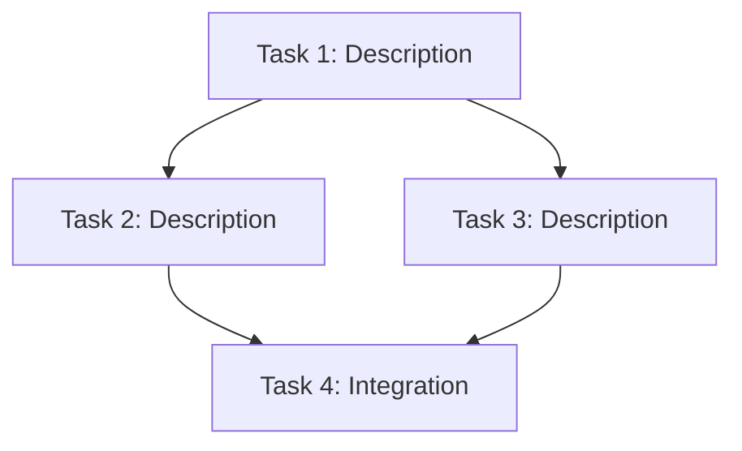
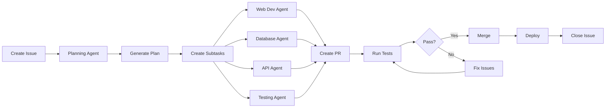

# Project Plan - AI Agent Development Framework

**Last Updated**: Auto-generated by Planning Agent
**Status**: Template

---

## 📋 Overview

This document tracks the execution plan for tasks managed by the AI Agent system. The Planning Agent automatically updates this file when new issues are created and decomposed into subtasks.

---

## 🎯 Active Projects

### Project Template

**Parent Issue**: #[Issue Number]
**Status**: 🔴 Not Started | 🟡 In Progress | 🟢 Complete
**Created**: [Date]
**Estimated Completion**: [Date]

#### Task Breakdown

| Task ID | Description | Agent | Status | Dependencies | Notes |
|---------|-------------|-------|--------|--------------|-------|
| T1 | Task description | `agent:type` | 🔴 | None | - |
| T2 | Task description | `agent:type` | 🔴 | T1 | - |
| T3 | Task description | `agent:type` | 🔴 | T1, T2 | - |

#### Execution DAG

#### Progress Log

- **[Date]**: Planning Agent created execution plan
- **[Date]**: T1 assigned to `agent:web-dev`
- **[Date]**: T1 completed, PR #X merged
- **[Date]**: T2 started by `agent:database`

---

## 📊 Project Statistics

### Current Sprint
- **Total Tasks**: 0
- **Completed**: 0
- **In Progress**: 0
- **Blocked**: 0

### Agent Utilization
- **Web Dev Agent**: 0 tasks
- **Database Agent**: 0 tasks
- **API Agent**: 0 tasks
- **Testing Agent**: 0 tasks
- **DevOps Agent**: 0 tasks
- **Documentation Agent**: 0 tasks

---

## 🎓 How to Use This System

### For Developers

1. **Create an Issue**
   - Describe what you want to build
   - Be as detailed as possible
   - Add context, requirements, constraints

2. **Planning Agent Activates**
   - Analyzes your issue
   - Breaks it down into subtasks
   - Creates sub-issues with appropriate labels
   - Updates this plan document

3. **Specialized Agents Execute**
   - Each subtask assigned to specialized agent
   - Agents work autonomously in GitHub Actions
   - Progress tracked via issue comments
   - PRs created when complete

4. **Review & Integrate**
   - Review agent-created PRs
   - Run automated tests
   - Merge when ready
   - Deploy automatically

### For Agents

**Planning Agent**:
- Monitor new issues
- Decompose complex tasks
- Create subtask issues
- Update this document
- Track progress

**Specialized Agents**:
- Read assigned issue
- Review parent issue for context
- Follow `.github/AGENTS.md` guidelines
- Implement solution with tests
- Create PR and update issue

---

## 📈 Success Metrics

### Quality Metrics
- ✅ All tests passing before merge
- ✅ Code coverage > 80%
- ✅ No security vulnerabilities
- ✅ Documentation complete

### Performance Metrics
- ⏱️ Average task completion time
- 🔄 PR merge rate
- ❌ Failure/retry rate
- 📊 Agent utilization

---

## 🛠️ Configuration

### Agent Labels
- `agent:planning` - Planning/Orchestration
- `agent:web-dev` - Frontend/UI development
- `agent:database` - Database schema and migrations
- `agent:api` - Backend API endpoints
- `agent:testing` - Test writing and QA
- `agent:devops` - Deployment and infrastructure
- `agent:docs` - Documentation

### Status Labels
- `planning-complete` - Task decomposition done
- `in-progress` - Agent actively working
- `has-pr` - PR created, awaiting review
- `ready-for-review` - All checks passed
- `blocked` - Waiting on dependency
- `auto-merge-enabled` - Will auto-merge when approved

---

## 📚 Resources

- **Agent Instructions**: [.github/AGENTS.md](.github/AGENTS.md)
- **Architecture Docs**: [docs/ARCHITECTURE.md](docs/ARCHITECTURE.md)
- **Setup Guide**: [README.md](README.md)
- **Supabase Docs**: https://supabase.com/docs
- **GitHub Actions**: https://docs.github.com/actions

---

## 🔄 Workflow Diagram

---

## 💡 Tips for Maximum Productivity

1. **Write Clear Issues**
   - Be specific about requirements
   - Include examples and context
   - Mention any constraints or dependencies

2. **Trust the Agents**
   - Let them handle boilerplate and setup
   - Review their work, but don't micromanage
   - Provide feedback through issue comments

3. **Use Labels Effectively**
   - Add `priority:high` for urgent tasks
   - Add `good-first-issue` for simple tasks
   - Add `help-wanted` to invite collaboration

4. **Monitor Progress**
   - Check this document regularly
   - Review agent comments on issues
   - Watch for PRs that need review

5. **Iterate and Improve**
   - Give feedback to refine agent behavior
   - Update `.github/AGENTS.md` with learnings
   - Adjust workflows as needed

---

*This project plan is automatically maintained by the Planning Agent. Manual edits will be preserved in most cases, but may be overwritten during major updates.*
